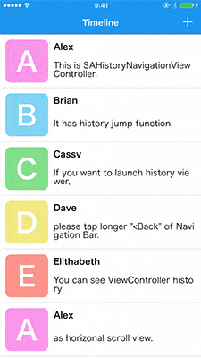
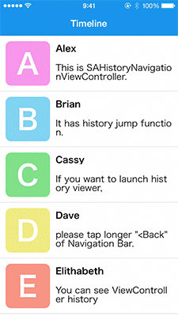
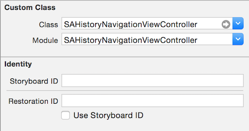

# SAHistoryNavigationViewController

[](https://developer.apple.com/iphone/index.action)
[](https://developer.apple.com/swift)
[](http://cocoapods.org/pods/SAHistoryNavigationViewController)
[](http://cocoapods.org/pods/SAHistoryNavigationViewController)

**Support 3D Touch for iOS9!!**





SAHistoryNavigationViewController realizes iOS task manager like UI in UINavigationContoller.

[ManiacDev.com](https://maniacdev.com/) referred.  
[https://maniacdev.com/2015/03/open-source-component-enhancing-the-back-button-with-view-history-navigation](https://maniacdev.com/2015/03/open-source-component-enhancing-the-back-button-with-view-history-navigation)

## Features

- [x] iOS task manager like UI
- [x] Launch Navigation History with Long tap action of Back Bar Button
- [x] Support Swift2.0
- [x] Support 3D Touch (If device is not supported 3D Touch, automatically replacing to long tap gesture.)
- [x] Support Swift2.3
- [x] Sipport Swift3

## Installation

#### CocoaPods

SAHistoryNavigationViewController is available through [CocoaPods](http://cocoapods.org). If you have cocoapods 0.38.0 or greater, you can install
it, simply add the following line to your Podfile:

    pod "SAHistoryNavigationViewController"

#### Manually

Add the [SAHistoryNavigationViewController](./SAHistoryNavigationViewController) directory to your project.

## Usage

If you install from cocoapods, You have to write `import SAHistoryNavigationViewController`.


#### Storyboard or Xib


Set custom class of UINavigationController to SAHistoryNavigationViewController.
In addition, set module to SAHistoryNavigationViewController.

#### Code

You can use SAHistoryNavigationViewController as `self.sah.navigationController` in any ViewController, bacause implemented `extension SAHistoryExtension` as below codes.

```swift
public protocol SAHistoryCompatible {
    associatedtype CompatibleType
    var sah: CompatibleType { get }
}

public extension SAHistoryCompatible {
    public var sah: SAHistoryExtension<Self> {
        return SAHistoryExtension(self)
    }
}

public final class SAHistoryExtension<Base> {
    public let base: Base
    public init(_ base: Base) {
        self.base = base
    }
}

extension UIViewController: SAHistoryCompatible {}

extension SAHistoryExtension where Base: UIViewController {
    public var navigationController: SAHistoryNavigationViewController? {
        return base.navigationController as? SAHistoryNavigationViewController
    }
}
```

And you have to initialize like this.


```swift
let ViewController = UIViewController()
let navigationController = SAHistoryNavigationViewController()
navigationController.setViewControllers([ViewController], animated: true)
presentViewController(navigationController, animated: true, completion: nil)
```

If you want to launch Navigation History without long tap action, use this code.

```swift
//In any UIViewController
self.sah.navigationController?.showHistory()
```

## Customize

If you want to customize background of Navigation History, you can use those methods.

```swift
//In any UIViewController
self.sah.navigationController?.contentView
self.sah.navigationController?.historyBackgroundColor
```

This is delegate methods.

```swift
@objc public protocol SAHistoryNavigationViewControllerDelegate: NSObjectProtocol {
    optional func historyControllerDidShowHistory(controller: SAHistoryNavigationViewController, viewController: UIViewController)
}
```

## Requirements

- Xcode 8.0 or greater
- iOS8.0 or greater
- [MisterFusion](https://github.com/szk-atmosphere/MisterFusion)

## Author

Taiki Suzuki, s1180183@gmail.com

## License

SAHistoryNavigationViewController is available under the MIT license. See the LICENSE file for more info.
